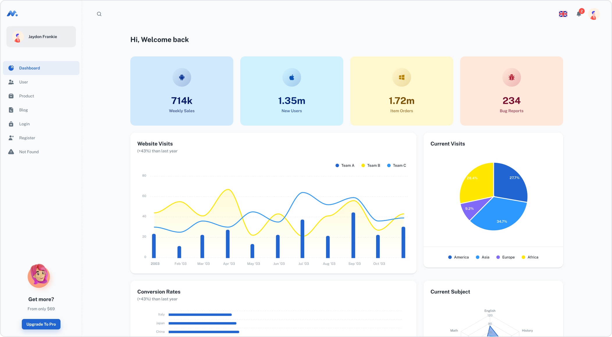

## Django+Minimal [(Free version)](https://bit.ly/3kB5lNT)

> Free Django+React Admin Dashboard made with Material-UI components and React.

## Getting started

> [Video instruction](https://minimals.cc/components)  

> Recommended `node js 14.x` and `npm 6+`

- Create Django project `django-admin startproject core .`
- Clone/Fork this project `git clone https://github.com/NeoUKR/DjangoMinimalMaterialKitReact.git`
- Modify `settigs.py`
> INSTALLED_APPS = [..., 'DjangoMinimalMaterialKitReact',]
- Modify `urls.py`
> from django.urls import path, include
> 
> urlpatterns = [path('', include('DjangoMinimalMaterialKitReact.urls')),]
- Migrate DB: `python3 manage.py migrate`
> Change directory `cd DjangoMinimalMaterialKitReact`
- Install dependencies: `npm install` or `yarn install`
- Build project / Development mode `npm run build` or `npm run dev`
- Start django server: `python3 manage.py runserver`

| [Minimal Free](https://bit.ly/3kB5lNT) | [Minimal](https://bit.ly/3OOfzIV) |
| ----------------------------------------------------- | :---------------------------------------------------------------- |
| **7** Demo pages                                      | **42+** demo pages                                                |
| -                                                     | ✓ Multi-language                                                  |
| -                                                     | ✓ Dark/Light Mode 🌓                                              |
| -                                                     | ✓ [More components](https://bit.ly/3MN0Pbf)               |
| -                                                     | ✓ TypeScript version                                              |
| -                                                     | ✓ Design files (Figma & Sketch)                                   |

## Page demo

- [Dashboard](https://bit.ly/3vzhLfE)
- [Users](https://bit.ly/3vBuoGR)
- [Product](https://minimal-kit-react.vercel.app/dashboard/products)
- [Blog](https://minimal-kit-react.vercel.app/dashboard/blog)
- [Login](https://minimal-kit-react.vercel.app/login)
- [Register](https://minimal-kit-react.vercel.app/register)
- [Not Found](https://minimal-kit-react.vercel.app/404)

## License

Distributed under the MIT License. See [LICENSE](https://github.com/minimal-ui-kit/minimal.free/blob/main/LICENSE.md) for more information.
